## Κάνοντας την πόλη μας πιο φιλική στο περιβάλλον  "το πράσινο σπίτι"

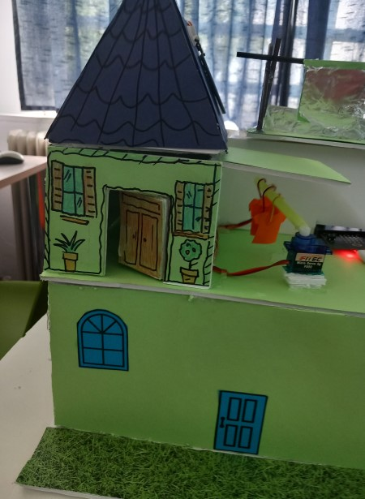

### Το πρόβλημα 
Οι σημερινές πόλεις χαρακτηρίζονται από έντονα προβλήματα ρύπανσης και σπατάλη ηλεκτρικής ενέργειας. Οι μαθητές θα προτείνουν τρόπους  με τους οποίους οι ανανεώσιμες πηγές ενέργειας μπορούν να αξιοποιηθούν σε ένα σπίτι. Οι μαθητές το ονόμασαν το "Πράσινο σπίτι". Εξοικονομώντας ενέργεια και προωθώντας τις ανανεώσιμες πηγές  ενέργειες έχουμε σημαντικά πλεονεκτήματα στο περιβάλλοντος και στην οικονομία μιας οικογένειας.

Η ιδέα του "πράσινου σπιτιού" μπορεί να επεκταθεί σε μια ολόκληρη πόλη κάνοντας την πόλη πιο φιλική στο περιβάλλον

### Α Φάση
#### Η Αρχική ιδέα
Μια έξυπνη πόλη στοχεύει στην καλύτερη διαχείριση της ηλεκτρικής ενέργειας στα σπίτια. Στοχεύει επίσης στη δημιουργία ενός πιο ευχάριστου περιβάλλοντος διαβίωσης για όλους με λιγότερες εκπομπές.

Με τη διαρκώς αύξηση του φαινόμενου της κλιματικής αλλαγής, όλο και περισσότεροι άνθρωποι στρέφονται στις ανανεώσιμες πηγές ενέργειας για τα σπίτια τους. Οι ανανεώσιμες πηγές ενέργειας είναι ένας καθαρός τρόπος για να τροφοδοτήσουμε το "πράσσινο"  σπίτι μας. Υπάρχουν πολλά οφέλη από τη χρήση ανανεώσιμων πηγών ενέργειας στο σπίτι μας. Ίσως το πιο προφανές όφελος είναι ότι είναι μια καθαρότερη και πιο φιλική προς το περιβάλλον επιλογή από τα παραδοσιακά ορυκτά καύσιμα 

Η ιδέα προβλέπει την αξιοποίηση του ήλιου του αέρα και της βροχής έτσι ώστε σε κάθε σπίτι να γίνεται καλύτερη διαχείριση της ενέργειας.

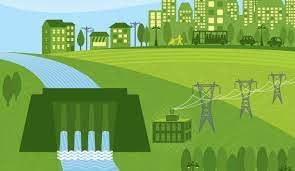

**Συγκεκριμένα**
Το πράσινο σπίτι θα διαθέτει δυο βασικούς αυτοματισμούς:

Α) Το στέγνωμα των ρούχων θα γίνεται αυτόματα ανάλογα με τις καιρικές συνθήκες. Τα ρούχα ενός νοικοκυριού θα βρίσκονται σε ένα υπόστεγο και ανάλογα με το αν υπάρχει βροχή ή ηλιοφάνεια ή αέρας αυτόματα θα προφυλάσσονται από τις καιρικές συνθήκες για πιο γρήγορο στέγνωμα.  
Έτσι θα γίνεται εξοικονόμηση ενέργειας με το να αποφεύγετε η χρήση του στεγνωτηρίου και η υγρασία στα σπίτια με το άπλωμα των ρούχων μέσα στο σπίτι.

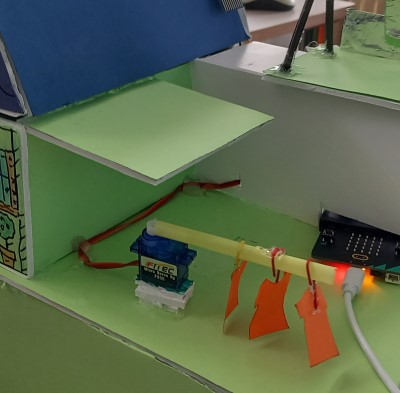

Β) Αυτόματος εξαερισμού του σπιτιού με το άνοιγμα των παραθύρων ανάλογα με τις καιρικές συνθήκες.  Ο αυτόματος εξαερισμός του σπιτιού μπορεί να βελτιώσει την ροή του αέρα με το να απομακρύνει την υγρασία τον χειμώνα και το καλοκαίρι να δροσίσει το σπίτι έτσι επιτυγχάνεται η εξοικονόμηση ενέργειας σε ένα σπίτι 

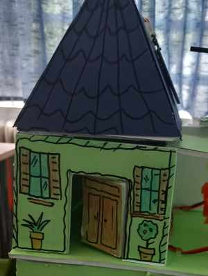

#### Σκοπός Project
Κεντρικός στόχος του έργου είναι η  χρήση αυτοματισμών  που θα βοηθήσουν στην εξοικονόμηση ενέργειας σε ένα σπίτι και κατά επέκταση σε μια ολόκληρη πόλη αξιοποιώντας τις ανανεώσιμες πηγές ενέργειας.

Ένας από τους βασικούς σκοπούς είναι οι μαθητές να εμπλακούν ενεργά σε όλη την εκπαιδευτική διαδικασία από την φάση του σχεδιασμού μέχρι την φάση της ολοκλήρωσης του project. Η ομάδα μας επέλεξε απλά υλικά, έφτιαξε  τον δικό της αισθητήρα αέρα  και οι αλγόριθμοι ήταν κατανοητοί και εύκολοι προς υλοποίηση από τους μαθητές.

**Επίσης κάθε ομάδα δούλεψε πάνω στο δικό της φύλλο εργασίας.**

Για να τα πετύχουμε αυτό και να κάνουμε κατανοητό στους μαθητές το project

•	Οι μαθητές χωριστήκαν σε ομάδες.

•	 Κάθε ομάδα διάλεξε την υλοποίηση ενός αυτοματισμού  ανάλογα με τον βαθμό δυσκολίας 

•	Στο τέλος όλες οι κατασκευές των μαθητών ενώθηκαν για την υλοποίηση του τελικού project

•	Χρησιμοποιήθηκαν απλά υλικά και το περιβάλλον προγραμματισμού σε microbit που είναι φιλικό σε μικρές ηλικίες 

**Διδακτικοί Στόχοι** 

•	Να ενισχυθεί ο Ψηφιακός γραμματισμός των μαθητών πάνω στις ανοικτές τεχνολογίες

•	Να κατανοήσουν οι μαθητές τους τρόπους με τους οποίους μπορεί να γίνει εξυπνότερη η διαχείριση ηλεκτρικής ενέργειας  προς όφελος του   περιβάλλοντος

•	Να αποκτήσουν οι μαθητές οικολογική συνείδηση

•	Να αναπτύξουν την κριτική τους σκέψη δημιουργώντας αλγόριθμους για την υλοποίηση του project

•	Να συνεργαστούν αρμονικά σε ομάδες  για την ολοκλήρωση ενός project

•	Να αποκτήσουν ικανότητες επίλυσης προβλήματος

**Υλικοτεχνική Υποδομή**

•	 Η/Υ

•	Microbit κιτ μαζί με αισθητήρες

•	Υλικά για την κατασκευή μακέτας( Χαρτόνι, κόλα, ψαλίδι)

### Β΄ Φάση 

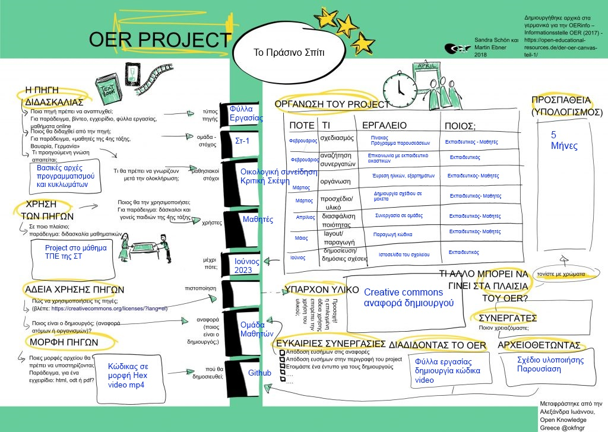

#### Η Αφόρμηση

Με βάση το παρακάτω βίντεο έγινε στην τάξη εισαγωγική συζήτηση για την πράσινη οικονομία και τους τρόπους που μπορεί να εφαρμοστεί σε ένα σπίτι και κατά επέκταση σε  μια πόλη

Ανανεώσιμες και μη πηγές ενέργειας - Φυσική Στ'

https://www.youtube.com/watch?v=tBFaP0RP_aM

#### Σχεδιασμός
Για την κατασκευή του σπιτιού αποτυπώσαμε σε χαρτί το αρχικό σχέδιο και  χρησιμοποιήσαμε μια μακέτα. Στο σπίτι δημιουργήσαμε ένα παράθυρο που ανοιγοκλείνει αυτόματα και ένα υπόστεγο για τα ρούχα.Για την υλοποίηση  του Project θα χρησιμοποιηθεί η πλακέτα Micro:bit. Πάνω στην μακέτα θα υλοποιηθούν 3 σενάριά ανάλογα με τις καιρικές συνθήκες

#### Σενάριο 1: Ύπαρξη βροχής στην ατμόσφαιρα

Στην περίπτωση που η μέρα είναι βροχερή αυτόματα τα παράθυρα του σπιτιού θα κλείνουν έτσι ώστε να αποφεύγετε η απώλεια θερμότητας σε ένα σπίτι και η υγρασία.Επιπλέον τα ρούχα θα μετακινούνται στο  προστατευτικό στέγαστρο για γρηγορότερο στέγνωμα

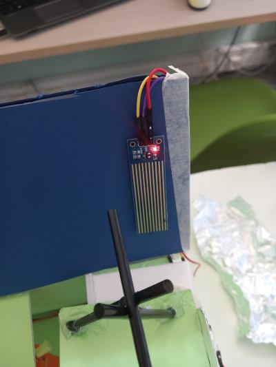 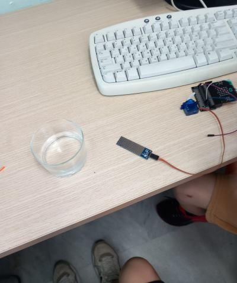

Αυτοματισμός: Έλεγχος υγρασίας στην ατμόσφαιρα

Αισθητήρας: Με έναν αισθητήρα υγρασίας στην οροφή του σπιτιού ελέγχεται αν είναι βροχερή η μέρα ή όχι

Ενεργοποιητής :  Κινητήρας (servo) για το αυτόματο άνοιγμα των παραθύρων και την μετακίνηση των ρούχων έξω από το υπόστεγο

#### Σενάριο 2: Ύπαρξη ηλιοφάνειας στην ατμόσφαιρα

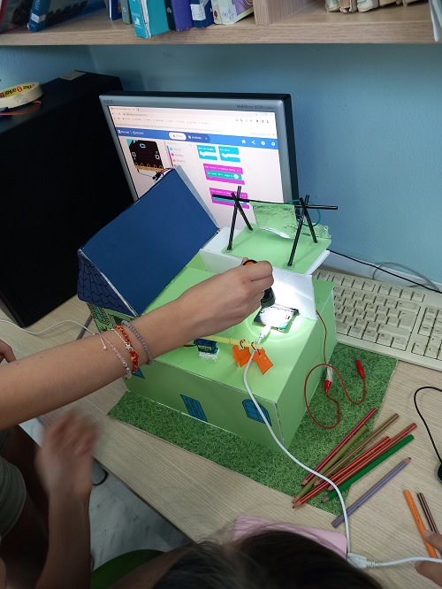 

Στην περίπτωση ηλιοφάνειας τα παράθυρα του σπιτιού θα ανοίγουν αυτόματα για να μειώνονται τα επίπεδα υγρασίας στο σπίτι με την ροή του αέρα τον χειμώνα και να επικρατεί δροσερή ατμόσφαιρα το καλοκαίρι.Τα ρούχα θα μετακινούνται από το υπόστεγο σε σημείο με ηλιοφάνεια για γρηγορότερο στέγνωμα

Αυτοματισμός: Έλεγχος ηλιοφάνειας της ατμόσφαιρας

Αισθητήρας: Η πλακέτα micro:bit διαθέτει αισθητήρα φώς στην μπροστινή πλευρά του. Με την χρήση ενός φακού γίνεται η προσομοίωση της ηλιοφάνειας

Ενεργοποιητής :  Κινητήρας (servo) για το αυτόματο άνοιγμα των παραθύρων και την μετακίνηση των ρούχων έξω από το υπόστεγο

#### Σενάριο 3: Ύπαρξη αέρα στην ατμόσφαιρα.

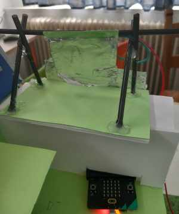 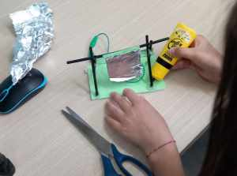

Στην περίπτωση που υπάρχει έντονος αέρας στην ατμόσφαιρα τα παράθυρα του σπιτιού θα ανοίγουν και τα ρούχα θα μετακινούνται έξω από το στέγαστρο για γρηγορότερο στέγνωμα.

Αυτοματισμός: Έλεγχος ηλιοφάνειας της ατμόσφαιρας

Αισθητήρας: Για τον έλεγχο ύπαρξης αέρα στην ατμόσφαιρα οι μαθητές δημιούργησαν τον δικό τους αισθητήρα δεν χρησιμοποιήθηκε έτοιμος αισθητήρας του εμπορίου. Με την χρήση απλών υλικών οι μαθητές έφτιαξαν έναν απλό αισθητήρα ανίχνευσης αέρα όπου τοποθετήθηκε στο πάνω μέρος του σπιτιού. Μπόρεσαν έτσι να καταλάβουν την λειτουργία των αισθητήρων, δημιουργία ενός ηλεκτρονικού κυκλώματος και θα μειωθεί το κόστος του Project.

Ενεργοποιητής :  Κινητήρας (servo) για το αυτόματο άνοιγμα των παραθύρων και την μετακίνηση των ρούχων έξω από το υπόστεγο

### Γ φάση

**Υλοποίηση "Πράσινου σπιτιού"**

**Υλικά:**

•	Μακετόχαρτο

•	Χαρτοταινία

•	Κόλλα

•	Συνδετήρες

•	Αλουμινόχαρτο

•	Χάρτινα καλαμάκια

Στο πρώτο στάδιο σχεδιάσαμε με τους μαθητές το σχέδιο του σπιτιού πάνω στην μακέτα. Στην συνέχεια κόψαμε και κολλήσαμε τα τμήματα του χαρτονιού για την δημιουργία του σπιτιού. Το ζωγραφίσαμε και το ονομάσαμε το πράσινο σπίτι.
Στην συνέχεια προχωρήσαμε στην κατασκευή των αυτοματισμών.

**Δημιουργία αυτόματου παραθύρου:**

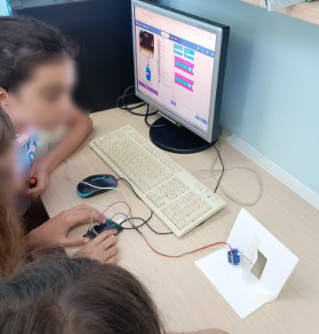 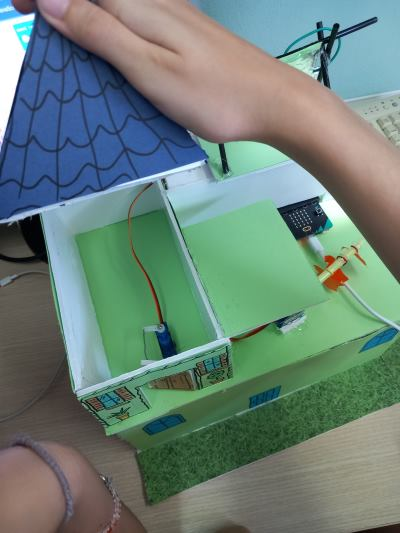

Στο μπροστινό τμήμα της μακέτας σχεδιάσαμε και κόψαμε ένα τμήμα του χαρτονιού σε μορφή πόρτας. Η μια πλευρά της πόρτας κολλήθηκε με χαρτοταινία. Στην συνέχεια ενώσαμε την πόρτα και το servo μοτέρ με ένα σύρμα από συνδετήρα. Όταν το servo μοτέρ περιστρέφεται 90 μοίρες ανοίγει το παράθυρο όταν περιστρέφεται 0 μοίρες κλείνει το παράθυρο.

**Δημιουργία υπόστεγου για τα ρούχα:**

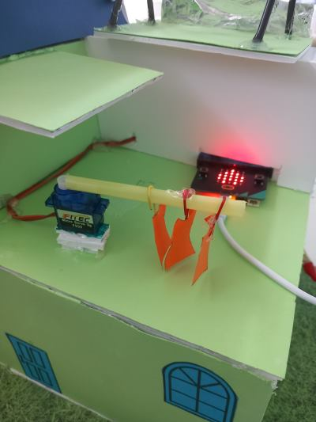 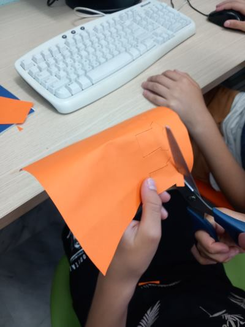

Σε ένα servo μοτέρ κολλήσαμε ένα καλαμάκι και πάνω στο καλαμάκι σχεδιάσαμε και κολλήσαμε χάρτινα μπλουζάκια με την χρήση συνδετήρων. Όταν το servo μοτέρ περιστρέφεται 90 μοίρες  τα ρούχα μεταφέροντα έξω από το υπόστεγο  όταν περιστρέφεται 0 μοίρες  τα ρούχα μεταφέρονται μέσα στο υπόστεγο.

**Δημιουργία αισθητήρα για τον έλεγχο ύπαρξης αέρα στην ατμόσφαιρα**

 

Οι μαθητές δημιούργησαν μια κατασκευή  με καλαμάκια και αλουμινόχαρτο. Στην περίπτωση αέρα ένα αλουμινόχαρτο που είναι στερεωμένο σε μια βάση ακουμπά ένα δεύτερο αλουμινόχαρτο και έτσι δημιουργείται κλειστό κύκλωμα. Στην περίπτωση που το micro:bit ανιχνεύει κλειστό κύκλωμα ενεργοποιούνται οι αυτοματισμοί του παράθυρου και των ρούχων. Η προσομοίωση του αέρα γίνεται φυσώντας προς την μεριά του αλουμινόχαρτου.

### Σχεδιασμός διδασκαλίας

Προαπαιτούμενες γνώσεις: Βασικές γνώσεις προγραμματισμού σε περιβάλλον οπτικού προγραμματισμού με τουβλάκια.

Προτεινόμενη τάξη: Έ- ΄ΣΤ΄ Δημοτικού

Τρόπος εργασίας των μαθητών: σε ομάδες

Αριθμός μαθητών: 6

Αριθμός Ομάδων: 3

Αριθμός ατόμων ανά ομάδα: 2

Ρόλοι: Δεν υπάρχουν διακριτοί ρόλοι στην ομάδα.

**Φύλλα εργασίας**

Η κάθε ομάδα ανάλαβε την υλοποίηση και τον προγραμματισμού ενός από τρία σενάρια

Ομάδα 1: Ανέλαβε την υλοποίηση του σεναρίου 1 για την ύπαρξη βροχής στην ατμόσφαιρα
Φύλλο εργασίας ομάδας 1

Ομάδα 2: Ανέλαβε την υλοποίηση του σεναρίου 2 για την ύπαρξη ηλιοφάνειας στην ατμόσφαιρα
Φύλλο εργασίας ομάδας 2

Ομάδα 3: Ανέλαβε την υλοποίηση του σεναρίου 3 :  για την ύπαρξη αέρα στην ατμόσφαιρα.
Φύλλο εργασίας ομάδας 3

### Συνδεσμολογία:

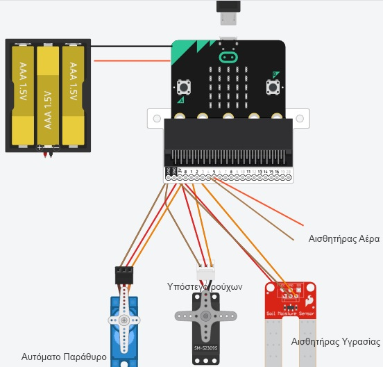

P0: Servo motor για πόρτα

P1: Servo motor για ρούχα

P2: Αισθητήρας υγρασίας

P3: Αισθητήρας αέρα

### Προγραμματισμός:

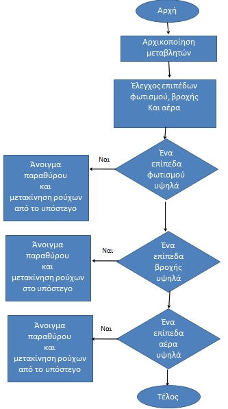

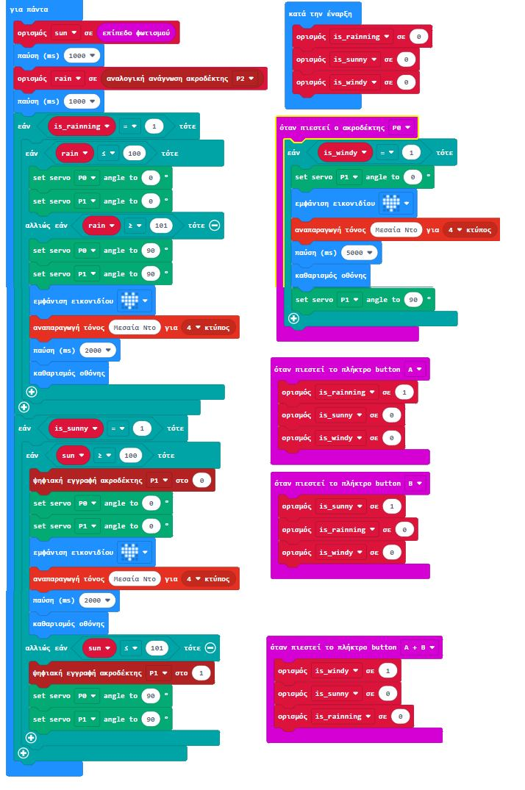

### ΤΟ ΑΠΟΤΕΛΕΣΜΑ

Ένα βίντεο με την αναλυτική παρουσίαση του έργου μπορείτε να δείτε εδώ

**Προτεινόμενες Δραστηριότητες για Επέκταση**

Στο "πράσινο σπίτι" μπορούμε να αυτοματοποιήσουμε τον φωτισμό. Στην περίπτωση χαμηλού φωτισμού στο περιβάλλον τα φώτα μπορούν να ανάβουν αυτόματα και στην περίπτωση ηλιοφάνειας να σβήνουν.

**Συμμετέχοντες Μαθητές Στ1**

Ιωάννα Λιονάκη

Φαίη Τσακανίκα

Σάρα Αγιάζη

Άνι Αμάτι

Γιώργος Κατσουλάκης

**Συμμετέχοντες Εκπαιδευτικοί**

Υπεύθυνος Εκπαιδευτικός πληροφορικής

Δαμανάκης Αντώνης

Υπεύθυνη Εκπαιδευτικός Εικαστικών

**Σελίδα στο github**

https://github.com/dimkolymbarioy/2023_robotics/

Αυτή η εργασία χορηγείται με άδεια Creative Commons Αναφορά Δημιουργού – Παρόμοια Διανομή 4.0 Διεθνές .

### Υλικά κατασκευής και ενδεικτικές τιμές:
1.	BBC micro:bit Board 18,90€
2.	Μπαταριοθήκη 3xΑΑ με JST PH 0,80€
3.	Servo Micro 2.2kg.cm Plastic Gears 2χ3,60€=7,2€
4.	Jumper Wires 15cm 2€
5.	Edge Connector Breakout Board for BBC micro:bit - Pre-built 6€
6.	Αισθητήρας υγρασίας 3€

Σύνολο 36€

### ΦΩΤΟΓΡΑΦΙΚΟ ΥΛΙΚΟ

